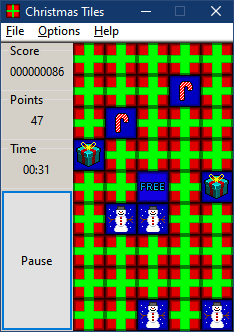
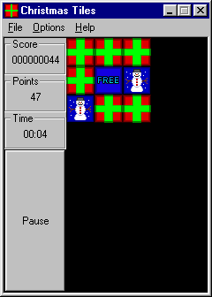

# Christmas Tiles

Christmas Tiles is a simple tile matching memory game for Windows (2000 all the way to 11). Flip over a present, and find a matching present to score.

Written in Pure Win32 API and C++.

## Requirements

- Windows 11(64-Bit Only)

- Windows 10 (64-Bit Only)

- Windows 8.1 (64-Bit Only) [1]

- Windows 7 (64-Bit Only)

- Windows Vista (64-Bit Only) [1]

- Windows XP[2] (32-Bit Only)

- Windows 2000[2] (32-Bit Only)

- Windows 98/ME (Via Kernel Ex)[3]

[1] Untested, no plans to test it.

[2] May have issues.

[3] Not officially supported, but happy to note it does work.

## Downloading

Windows 10 and 11 builds are here. They are Per-Monitor DPI compatible and only support 64-Bit.

Windows Vista/7/8 builds are here. They **should** work with DPI, and they are also 64-Bit only.

Windows XP and 2000 builds are here. These builds will work with the DPI API that they had and they are 32-Bit only.

The 32-Bit builds will also run on 32-Bit versions of Windows Vista/7/8/10, but they may or may not have issues, and DPI awareness is not a guarantee for them.

## Features

- Custom Tile sets

- Per Monitor DPI support

- Classic Windows 2000/XP DPI support

- UTF-8 Compliant, and easy to translate

- Small EXE. With just the standard tile set, the game is less than 150 KB.

## Screenshots

Windows 10

Windows 2000

Windows 98 SE

## Custom Tile Sets

Tiles are equal height and width. The height of the tile set image determines how wide each individual tile is. Thus if the height of the bitmap is 32 pixels tall, each tile will be 32 tiles wide.

## Translations

Currently only English is supported, and the menu item does nothing. If you would like to translate this program, please edit lang_en.txt and submit it to me.

## License

The code of Christmas Tiles is made available under the 3-Clause BSD license with the addition of the **Redistributions** clause from the Sleepcat License.
